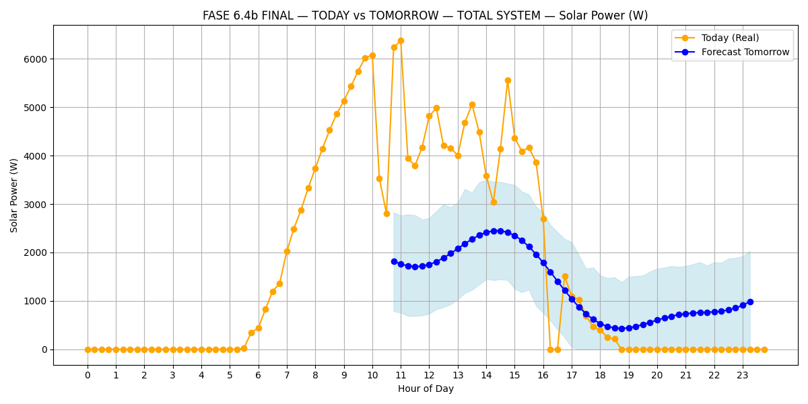
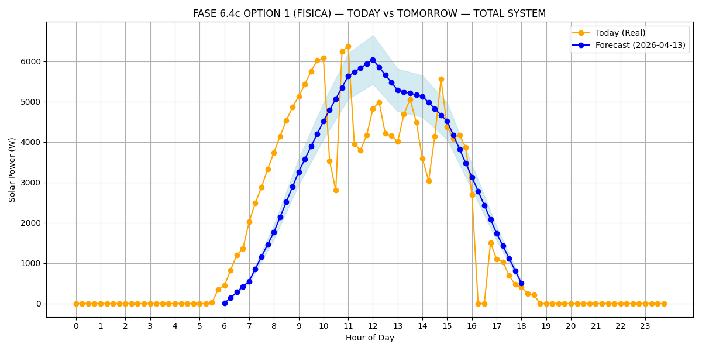

# Autonomous Solar Yield Forecaster ☀️

[](https://colab.research.google.com/github/runnet/smart-battery-forecaster/blob/main/FORECAST%20HOURLY%2BREGRESSOR%20GHI.ipynb)
[](./LICENSE)

A non-statistical, physics-based solar power forecasting engine built to do one job flawlessly: **predict tomorrow's physical PV yield** for a real residential installation.

Unlike black-box models (Prophet, LSTM, ARIMA) that tend to average out missing data, ignore recent hardware upgrades, and clip peak production, this engine uses a **Direct Physical Scaling** methodology. It analyzes your hardware's *proven recent capacity*, measures its real thermal efficiency against a clear-sky irradiance model, and then penalizes the resulting curve with satellite cloud tracking from Open-Meteo.

The output is intended as the "brain" for **home-automation peak shaving and battery arbitrage**: if tomorrow's forecast is strong, a local bot (Home Assistant, Solar Assistant, Node-RED, etc.) can safely drain grid-tied batteries tonight, knowing the sun will fully recharge them without touching the grid.

---

## 📸 Why Physics Beats Statistics

Early iterations used Prophet and raw NASA POWER irradiance data. The model confidently predicted hundreds of watts of production at 11 PM, ignored recently-upgraded inverter capacity, and pushed the production curve hours past sunset because of timezone drift.

| ❌ Before — statistical model (Prophet + NASA POWER) | ✅ After — physical scaling engine |
|:---:|:---:|
|  |  |
| Forecast starts at 11 AM, predicts ~1 kW at midnight, underestimates peak by 60%. | Forecast tracks the clear-sky bell, respects sunrise/sunset, and matches the inverter's proven peak. |

---

## ✨ Features

- **Pure physics**, no training set required — the model calibrates itself every night.
- **Auto-calibration** against the last 7 days of real inverter logs.
- **Clear-sky modeling** via `pvlib` using Ineichen/Perez or simplified Solis.
- **Cloud-aware GHI forecast** pulled from the Open-Meteo API.
- **Astronomical sunrise/sunset trimming** to force `0 W` during darkness.
- **Timezone-correct** curves (no more "sun rising at 1 PM" artifacts).
- **Multi-inverter aware**: automatically sums `ppv1 + ppv2 + ppv3` columns.
- **Hardware ceiling cap** to prevent unphysical over-predictions on cold, bright days.
- **15-minute resolution** operational curve + daily energy estimate (kWh).

---

## 📦 Repository Contents

```
├── FORECAST HOURLY+REGRESSOR GHI.ipynb   # Main notebook (run top-to-bottom)
├── Data/                                 # Drop your Growatt/ShinePhone exports here
├── README.md
└── LICENSE                               # MIT
```

---

## 🚀 Quickstart

### 1. Requirements
- Python 3.10+
- Jupyter / Google Colab
- Packages: `pandas`, `numpy`, `matplotlib`, `openpyxl`, `requests`, `pvlib`, `pytz`

```bash
pip install pandas numpy matplotlib openpyxl requests pvlib pytz
```

### 2. Drop your data
Export your historical inverter logs (e.g. from Growatt / ShinePhone) as `.xlsx` and place them in `./Data/`. The filename format used during development is:

```
INV_1 - 2025-01-07 - 2025-01-14.xlsx
INV_2 - 2025-01-07 - 2025-01-14.xlsx
```

### 3. Configure the notebook
Open `FORECAST HOURLY+REGRESSOR GHI.ipynb`. All tunables live in a single `SYSTEM CONFIGURATION` block at the top of Cell 1 — **no other code needs to be touched**.

---

## 🛠️ Configuration

### Geographic Location
Sets the Open-Meteo query and the astronomical sunrise/sunset window.
```python
LATITUDE      = 10.9685
LONGITUDE     = -74.7813
CITY_NAME     = "Barranquilla"
COUNTRY_NAME  = "Colombia"
TIMEZONE_STR  = "America/Bogota"
```

### Hardware Rating
Physical ceiling of your inverter(s). Anomalous cold-and-bright days will be mathematically capped here.
```python
SYSTEM_MAX_CAPACITY_W = 8700
```

### Data Ingestion
Folder + column names that contain your instantaneous DC power. Multi-string arrays are summed automatically.
```python
DATA_PATH   = './Data/'
RESULTS_PATH = './Results/'
PV_COLUMNS  = ['ppv1', 'ppv2', 'ppv3']
```

---

## 🔬 How It Works

1. **Auto-Calibration** — Scans the last 7 days of your logs and finds the absolute peak harvested power `(W)`. This becomes your *proven* recent capacity, not a historical average.
2. **Clear-Sky Reference** — Computes the theoretical maximum irradiance `(W/m²)` that could have hit your location during that same window using `pvlib`.
3. **Thermal Conversion Factor** — Divides proven peak power by peak irradiance. The result is your real-world DC→AC conversion efficiency, measured empirically, specific to your panels + inverter + wiring + dust.
4. **Tomorrow's GHI** — Fetches tomorrow's hour-by-hour Global Horizontal Irradiance from Open-Meteo (satellite + numerical weather prediction).
5. **Cloud Penalization** — Multiplies forecast GHI by your thermal factor to produce a 15-minute operational curve for tomorrow.
6. **Astral Trimming** — Forces `0 W` outside astronomical sunrise/sunset to eliminate numerical artifacts at night.
7. **Hardware Clip** — Any point above `SYSTEM_MAX_CAPACITY_W` is clipped to the physical inverter ceiling.

The final chart overlays three curves:
- 🟠 Today's actual production
- ⚪ Clear-sky theoretical maximum (dotted bell)
- 🔵 Tomorrow's physics-based forecast

---

## 🤖 Use Case: Battery Arbitrage

The original problem driving this engine: inverters tend to be too conservative. When batteries hit their 20% reserve at 2 AM, the system pulls from the grid — and then refuses to release battery back to the house until it has "topped off" 10% in the morning. That means paying for grid power until 7–8 AM **even on days with a brilliant sunrise**.

With a trustworthy forecast, a home-automation bot can:
- At 4:30 AM, read tomorrow's forecast kWh.
- If forecast > threshold → command the inverter to drop battery reserve to 0% and drain safely until sunrise.
- If forecast < threshold (storms, heavy cloud) → keep the reserve intact.

This notebook is the **forecast half** of that loop. The automation half is left to your orchestrator of choice (Home Assistant, Solar Assistant, Node-RED, a Telegram bot, etc.).

---

## 📈 Output

- Interactive matplotlib chart (today vs clear-sky vs tomorrow).
- Printed scalar summary: peak tomorrow `(W)`, total tomorrow `(kWh)`, sunrise/sunset times, thermal efficiency factor.
- Optional CSV drop into `./Results/` for downstream automation.

---

## 🤝 Contributing

Pull requests welcome. This engine was built for one house, but the physics is universal. If you adapt it for a different climate, inverter brand, or logging format, consider opening a PR with your data adapter.

Ideas on the roadmap:
- Solar Assistant / Home Assistant native integration.
- MQTT publisher for the forecast curve.
- Multi-day rolling forecast (48–72 h).
- Optional temperature-coefficient correction for panel derating.

---

## 📜 License

Released under the **MIT License** — see [`LICENSE`](./LICENSE). Free to use, modify, and redistribute, including for commercial purposes. No warranty.

---

## ⚠️ Disclaimer

This forecaster is a decision-support tool, not a guarantee. Weather is stochastic. Never configure your battery reserve in a way that risks your home's essential loads during a blackout without a manual override. Use at your own risk.
